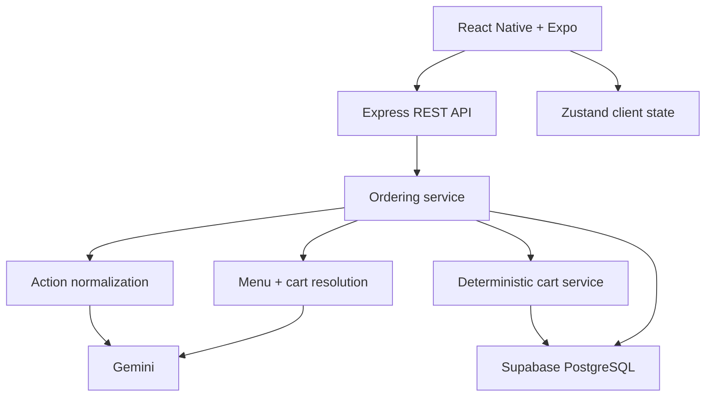
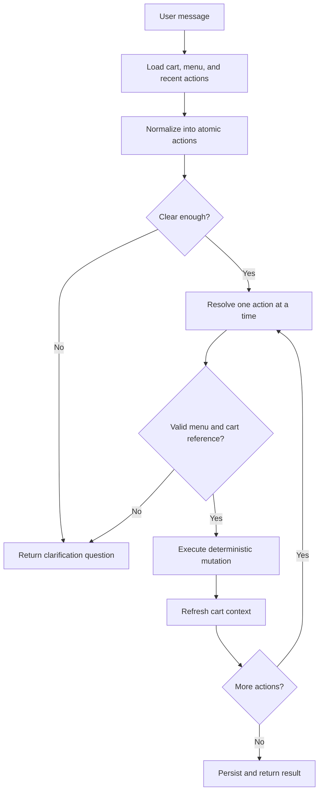

# AI Bistro Ordering

<p>
  <a href="https://www.typescriptlang.org/"></a>
  <a href="https://reactnative.dev/"></a>
  <a href="https://expo.dev/"></a>
  <a href="https://expressjs.com/"></a>
  <a href="https://www.postgresql.org/"></a>
  <a href="https://ai.google.dev/"></a>
  <a href="https://zustand-demo.pmnd.rs/"></a>
  <a href="https://vitest.dev/"></a>
</p>

AI Bistro Ordering is a full-stack conversational ordering application. It lets
customers browse a restaurant menu, manage a cart manually, or describe what
they want in natural language. The system interprets each request with an LLM,
but it does not allow model output to mutate application state directly.

Instead, the backend converts unstructured language into typed, ordered actions,
grounds those actions against real menu and cart data, validates the resulting
payload, and executes the final operation through deterministic cart services.
This keeps the interface conversational while making state changes predictable,
traceable, and testable.

## Demo

<p align="center">
  <a href="https://www.youtube.com/shorts/E6LAJtAj_kY">
    <kbd>
      
    </kbd>
  </a>
</p>
<p align="center">
  <a href="https://www.youtube.com/shorts/E6LAJtAj_kY">
    ▶ Watch the AI Bistro Ordering demo on YouTube
  </a>
</p>

Project write-up: [zhichzhang.dev/2026-07-17/ai-bistro-ordering](https://zhichzhang.dev/2026-07-17/ai-bistro-ordering)

<details>
<summary><strong>Table of contents</strong></summary>

- [Why this project](#why-this-project)
- [Features](#features)
- [Architecture](#architecture)
- [Ordering workflow](#ordering-workflow)
- [From language to deterministic execution](#from-language-to-deterministic-execution)
  - [1. Prompt context](#1-prompt-context)
  - [2. Action normalization](#2-action-normalization)
  - [3. Menu and cart resolution](#3-menu-and-cart-resolution)
  - [4. Deterministic cart execution](#4-deterministic-cart-execution)
- [Conversational references and multi-action requests](#conversational-references-and-multi-action-requests)
- [Ambiguity and invalid requests](#ambiguity-and-invalid-requests)
- [Canonical cart identity](#canonical-cart-identity)
- [Persistence model](#persistence-model)
- [API](#api)
- [Project structure](#project-structure)
- [Configuration](#configuration)
- [Run locally](#run-locally)
- [Tests](#tests)
- [Current scope](#current-scope)
- [License](#license)

</details>

## Why this project

Conversational ordering is not just a text-generation problem. A user may refer
to the same product in several ways, combine multiple operations in one message,
change an item midway through the conversation, or use a follow-up such as
"make that two." The request may also be ambiguous, unsupported, or inconsistent
with the available menu.

Those inputs eventually need to become exact state transitions: add a particular
menu item, update one cart line, replace a modifier, decrement a quantity, or ask
the customer for clarification. AI Bistro Ordering explores how to preserve the
flexibility of natural language without giving an LLM direct control over those
state transitions.

## Features

- Conversational ordering through a React Native prompt interface
- Traditional menu browsing and manual cart controls
- Ordered decomposition of compound requests into atomic actions
- Menu resolution using canonical ids, names, and aliases
- Context-aware references to cart positions and previously executed actions
- Clarification responses for ambiguous requests
- Rejection of unavailable menu items and unsupported modifiers
- Deterministic add, remove, quantity-update, modifier-update, and clear-cart operations
- Canonical cart-line identity for modifier-aware merging
- Persistent chat sessions, messages, normalized actions, resolutions, and carts
- Typed route, service, repository, mapper, and domain boundaries
- Service and HTTP-route tests with Vitest and Supertest

## Architecture



The LLM participates in interpretation and entity resolution. It does not write
to the database. All cart mutations pass through `CartService`, which operates
on resolved identifiers and validated modifier values.

## Ordering workflow



Actions are resolved and executed sequentially. After each successful mutation,
the service reloads the cart before resolving the next action. This allows later
actions in the same message to depend on the concrete result of earlier ones.

## From language to deterministic execution

### 1. Prompt context

Before interpreting a message, the backend builds a bounded context from:

- the current cart and each line's canonical identity;
- selected modifiers attached to each cart item;
- prompt-safe menu items, modifier choices, and aliases;
- the five most recent normalized actions; and
- actions already processed within the current message.

`PromptContextService` serializes database records into stable, purpose-specific
text rather than placing raw persistence objects directly into a prompt.

### 2. Action normalization

`NormalizationService` turns free-form input into a structured
`NormalizationResult`. Compound instructions are split into atomic actions while
preserving their order, source text, dependencies, and reference metadata.

For example:

```text
Add two spicy beef sandwiches and make one double
```

is represented conceptually as:

```json
{
  "intent": "multi_action",
  "status": "success",
  "actions": [
    {
      "index": 0,
      "type": "add_item",
      "target_text": "beef sandwich",
      "quantity": 2,
      "modifiers": { "spice": "spicy" },
      "depends_on": []
    },
    {
      "index": 1,
      "type": "modify_item",
      "target_text": "one sandwich",
      "modifiers": { "size": "double" },
      "reference": {
        "type": "previous_action",
        "action_index": 0
      },
      "depends_on": [0]
    }
  ]
}
```

The model response is parsed and checked at runtime before it is persisted or
passed to the next stage. Required fields, quantities, modifier maps, reference
objects, and dependency arrays are validated explicitly.

### 3. Menu and cart resolution

`ResolutionService` processes one normalized action at a time. It grounds the
requested item against the actual menu and converts conversational references
into concrete menu-item and cart-item identifiers.

Resolution uses:

- exact menu ids;
- configured aliases such as alternate product names;
- exact and partial name candidates;
- the current hydrated cart;
- cart positions;
- prior action results from the same request; and
- recent action history from the session.

The resolution payload is validated again before execution. Mutating actions
must provide a real `menu_item_id`, valid quantities where required, and a typed
reference-resolution object.

### 4. Deterministic cart execution

Only a successfully resolved action reaches `CartService`. The service supports:

| Action | Deterministic behavior |
| --- | --- |
| `add_item` | Validate the menu item, complete default modifiers, then create or merge a cart line |
| `modify_item` | Resolve one cart line, validate replacement modifiers, then update or merge it |
| `update_quantity` | Resolve one cart line and set its quantity; non-positive values remove it |
| `remove_item` | Decrement quantity first, then delete the line when one unit remains |
| `clear_cart` | Remove the cart's current contents |
| `view_cart` | Return state without mutation |

This separation creates a hard boundary: the model proposes a typed operation,
while ordinary application code decides whether and how that operation changes
state.

## Conversational references and multi-action requests

Each normalized action has an index and may record `depends_on` relationships.
During execution, the backend stores the resolved or referenced cart-item id for
every action. A later action can therefore refer to:

- a cart item id;
- a visible cart position;
- a unique matching item already in the cart;
- or the resolved result of an earlier action in the same message.

This is what lets a phrase such as "add a chicken sandwich and make it spicy"
remain one conversational request without collapsing both operations into an
unverifiable state mutation.

## Ambiguity and invalid requests

The pipeline distinguishes uncertainty from execution failure.

- If an item description matches several candidates, the API returns
  `needs_clarification` with a question and suggestions.
- If a clarification reply uniquely identifies a candidate, it is converted
  back into an explicit add action and re-enters the pipeline.
- If an item is absent from the menu, resolution classifies it as invalid rather
  than inventing an id.
- If a modifier group or option does not exist for the selected item,
  deterministic execution rejects it.
- If one resolved action fails during a compound request, the response records a
  `partial_failure` instead of reporting the entire request as successful.

## Canonical cart identity

Two lines should merge only when they represent the same configured product.
The backend creates a canonical identity from the menu-item id and a sorted set
of modifier key-value pairs.

```text
menu_item_id | modifier_a=value | modifier_b=value
```

When an item is added, the service first completes any omitted modifier groups
with their configured defaults. It then searches for an equivalent canonical
identity. Matching lines have their quantities combined; different modifier
combinations remain separate. The same rule is applied when modifiers are
replaced, so a modified line can merge into an already equivalent line instead
of creating duplicate cart state.

## Persistence model

The PostgreSQL schema separates product data, customer state, and orchestration
history.

| Area | Tables | Purpose |
| --- | --- | --- |
| Menu | `categories`, `menu_items`, `modifier_groups`, `modifier_options`, `menu_item_modifier_groups`, `menu_aliases` | Canonical product catalog and valid configurations |
| Cart | `carts`, `cart_items`, `cart_item_modifiers` | Hydrated cart state, ordering positions, quantities, totals, and canonical identities |
| Conversation | `chat_sessions`, `chat_messages` | Session ownership and user/assistant history |
| Orchestration | `chat_message_actions` | Normalized actions, dependencies, references, resolution results, confidence, and execution state |

Persisting intermediate action state makes the ordering pipeline inspectable:
the original message, normalized action, resolved identifiers, reference chain,
and execution outcome can be examined independently.

## API

All routes are mounted below `/api`.

| Method | Route | Purpose |
| --- | --- | --- |
| `GET` | `/health` | Service health check |
| `GET` | `/menu/categories` | List menu categories |
| `GET` | `/menu/items` | List menu items |
| `GET` | `/menu/items/:itemId` | Load one menu item |
| `GET` | `/menu/context` | Load prompt-safe menu context |
| `POST` | `/carts` | Create a cart and associated session |
| `GET` | `/carts/:cartId` | Load a hydrated cart |
| `GET` | `/carts/:cartId/summary` | Load a lightweight cart summary |
| `POST` | `/carts/:cartId/items` | Add a cart item manually |
| `PATCH` | `/carts/:cartId/items/:cartItemId` | Update quantity or modifiers |
| `PUT` | `/carts/:cartId/items/:cartItemId` | Replace a cart line |
| `DELETE` | `/carts/:cartId/items/:cartItemId` | Decrement or remove a cart line |
| `POST` | `/chat/sessions` | Create a chat session |
| `GET` | `/chat/sessions/:sessionId/messages` | Load recent conversation history |
| `POST` | `/ordering/sessions/:sessionId/turn` | Run one conversational ordering turn |

Example ordering request:

```bash
curl -X POST \
  http://localhost:3000/api/ordering/sessions/SESSION_ID/turn \
  -H 'Content-Type: application/json' \
  -d '{"userMessage":"Add two spicy chicken sandwiches"}'
```

## Project structure

```text
.
├── apps
│   ├── mobile
│   │   ├── App.tsx
│   │   └── src
│   │       ├── components
│   │       ├── overlays
│   │       ├── screens
│   │       ├── services
│   │       ├── store
│   │       ├── types
│   │       └── utils
│   └── server
│       └── src
│           ├── db
│           │   └── repositories
│           ├── mappers
│           ├── prompts
│           ├── routes
│           ├── scripts
│           ├── services
│           └── types
└── packages
    └── shared
        ├── menu.json
        └── schema.sql
```

The mobile and server applications are installed and run independently. Shared
seed data and the database schema live in `packages/shared`.

## Configuration

### Backend environment

Create `apps/server/.env`:

```env
GEMINI_API_KEY=your_gemini_api_key
SUPABASE_URL=your_supabase_project_url
SUPABASE_KEY=your_supabase_key
```

The Express server listens on port `3000`.

### Mobile environment

Create `apps/mobile/.env`:

```env
EXPO_PUBLIC_API_BASE_URL=http://YOUR_LOCAL_IP:3000/api
```

For a physical device, use the development machine's LAN address rather than
`localhost`.

## Run locally

### 1. Create the database

Create a Supabase project, open its SQL editor, and run:

```text
packages/shared/schema.sql
```

### 2. Install and configure the server

```bash
cd apps/server
npm install
```

Add the backend environment variables described above.

### 3. Ingest the menu

From `apps/server`:

```bash
npm run ingest
```

The ingestion script loads `packages/shared/menu.json` into the normalized menu,
modifier, and alias tables.

### 4. Start the API

From `apps/server`:

```bash
npm run dev
```

The API is available at `http://localhost:3000/api`.

### 5. Install and start the mobile app

```bash
cd apps/mobile
npm install
npm run start
```

Open the app with Expo Go or run one of the platform targets:

```bash
npm run ios
npm run android
npm run web
```

## Tests

The server test suite covers repository connectivity, menu and cart behavior,
chat services, normalization and resolution validation, orchestration, and HTTP
routes.

From `apps/server`:

```bash
npm run test:run
```

For watch mode:

```bash
npm test
```

HTTP-route tests use Supertest; service and orchestration tests use Vitest mocks
and fixtures to isolate external model and persistence behavior where needed.

## Current scope

- Ordering input and prompt behavior are designed for English.
- Gemini is the configured text-generation provider.
- Supabase provides the PostgreSQL persistence layer.
- The repository focuses on ordering and cart orchestration; authentication,
  payments, fulfillment, and production deployment automation are outside its
  current scope.

## License

Copyright (c) 2026 Zhicheng Zhang.

This project is licensed under the
[PolyForm Noncommercial License 1.0.0](LICENSE).
